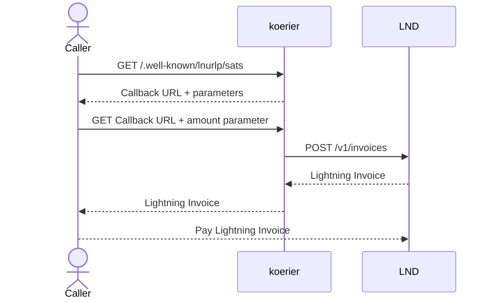

# koerier

_koerier_ is Dutch for courier: someone that collects and delivers messages. _koerier_ collects
lightning invoice requests and delivers lightning invoices.

## Usage

Install the Rust toolchain:
```shell
curl --proto '=https' --tlsv1.2 -sSf https://sh.rustup.rs | sh
```

Clone this repository and install the binary:
```
git clone https://github.com/luisschwab/koerier
cd koerier
cargo install --path .
```

Create a TOML file with these fields:
```toml
[koerier]
domain = "https://example.org" # the domain used on the callback URL
bind_address = "0.0.0.0:1337" # the address koerier will listen on
description = "How much a dollar really cost?" # description that will be displayed when the LNURL endpoint is hit
image_path = "./image.png" # optional: path to an image that will be displayed when the LNURL endpoint is hit

[lnd]
rest_host = "127.0.0.1:8080" # LND's REST address
tls_cert_path = "~/.lnd/tls.cert" # path to LND's TLS certificate
invoice_macaroon_path = "~/.lnd/data/chain/bitcoin/mainnet/invoice.macaroon" # path to LND's invoice macaroon
min_invoice_amount = 1 # the minimum allowed invoice amount in sats
max_invoice_amount = 1_000_000 # the maximum allowed invoice amount in sats
invoice_expiry_sec = 3600 # the invoice expiry time in seconds
```

Then run it:
```shell
koerier -c config.toml
[2025-09-06T02:49:15Z INFO  koerier] Successfully parsed configuration from `config.toml`
[2025-09-06T02:49:15Z INFO  koerier] koerier is bound and listening at 0.0.0.0:1337
```

Optionally, use the example `systemd` service provided here:
```shell
cp koerier.service.example /etc/systemd/system/koerier.service
systemctl daemon-reload
systemctl enable koerier.service
systemctl start koerier.service
```

Since `koerier` does not implement TLS termination, you need to have a webserver acting as a reverse proxy in front of it.
You can use the provided [Caddyfile](./Caddyfile.example), or adapt it to another webserver implementation:

```Caddyfile
example.org {
     handle /.well-known/lnurlp* {
         reverse_proxy 10.10.10.10:1337 {
             header_down Access-Control-Allow-Origin "*"
             header_down Access-Control-Allow-Methods "GET, POST, OPTIONS"
             header_down Access-Control-Allow-Headers "Content-Type"
         }
     }
     handle /lnurlp/callback* {
         reverse_proxy 10.10.10.10:1337 {
             header_down Access-Control-Allow-Origin "*"
             header_down Access-Control-Allow-Methods "GET, POST, OPTIONS"
             header_down Access-Control-Allow-Headers "Content-Type"
         }
     }
}
```

## Architecture

`koerier` is a middleware that implements the Lightning Address, specified in [LUD06]().
It sits between the caller, usually a lightning wallet, and a LND node. The caller
hits the correct endpoint and receives a lightning invoice.

## Lightning Address

A lightning address is an internet identifier identical to an email address–_sats@luisschwab.net_ is a lightning address–
designed to make it easy to pay to someone in a non-interactive way, without the need to ask the person for an invoice.

The part before the `@` specifies the user and the part after the `@` specifies the provider.

Let's say you want to make a payment to the `sats` user, which has an account with the `luisschwab.net` provider.
The caller can make a `GET` request to `https://luisschwab.net/.well-known/lnurlp/luisschwab`, and receive a response
in this format:

```json
{
  "metadata": "[[\"text/plain\",\"Money order in the name of Luis Schwab\"]]",
  "tag": "payRequest",
  "minSendable": 1000,
  "maxSendable": 1000000000,
  "callback": "https://luisschwab.net/lnurlp/callback"
}
```

Then the caller makes another `GET` request to the callback URL, with an `amount` parameter with the desired invoice
amount in milli-satoshis, respecting the boundaries set by `minSendable` and `maxSendable` (these are also in milli-satoshis):

```shell
curl "https://luisschwab.net/lnurlp/callback?amount=1000"
```

```json
{
  "pr": "lnbc10n1p5teqcqpp5wms2zf7484prd5qrfrhvujsplxdvn02qargeega73m2wwr4w7m3shp5v9h3gnjjae46gpgsglr8everxdx2xcwdrv639mf56s7l65def5kqcqzysxqrrsssp5t5hf4t3pz5cxduf0cjdh0g098c8gxs27mpvm2jwu6rm0qv3rq68s9qxpqysgqshl7d530ekw2lz94am96yfct9s0vumscr3808vqy2d7kgs08ltzppqq3dm0mgwtlzu2wk26m964d79pmdlmmz5nc6he2u7lqh60gmhgqm2efh2",
  "routes": []
}
```

Then the caller extracts the `pr` field and pays the invoice normally.

## Sequence Diagram

This is the sequence diagram for the entire workflow, in accordance with [LUD06](https://github.com/lnurl/luds/blob/luds/06.md):


